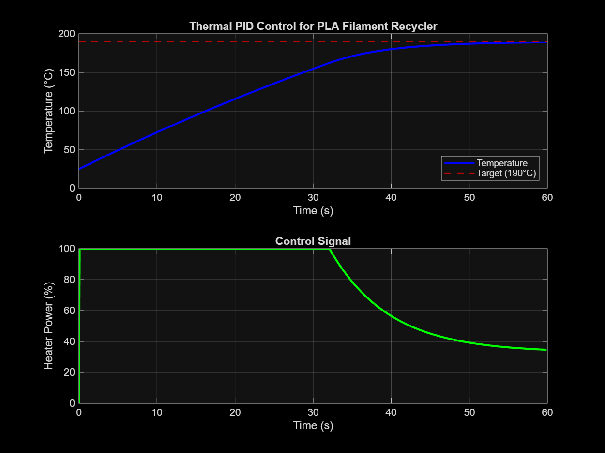

# PI-Controlled Thermal System for PLA Filament Recycler

**Senior Design Project | 3D Printer Waste Recycling**

This simulation models the thermal control system from my senior design project: a 3D printer filament recycler that melts waste PLA. A **PI controller** maintains the target temperature (190°C) using a heating element and thermocouple feedback.

## Why PI, Not PID

For thermal systems, derivative action amplifies sensor noise without meaningful benefit. PI control provides:
- Zero steady-state error
- Smooth, noise-resistant response
- Simpler tuning (only Kp and Ki)

## System Parameters

| Parameter | Value | Description |
|-----------|-------|-------------|
| Target temperature | 190°C | PLA melting point |
| Ambient temperature | 25°C | Starting temp |
| Thermal capacity (C) | 200 J/°C | How much energy to raise temp |
| Thermal resistance (R) | 0.5 °C/W | Heat loss rate |
| Heater influence (k) | 1000 W | Max heating power |

## PI Gains (Tuned)

| Gain | Value |
|------|-------|
| Kp | 2.5 |
| Ki | 0.01 |

## Simulation Results



The PI controller reaches 190°C with minimal overshoot and zero steady-state error.
```
=== Controller Performance ===
Rise time (to 90% of target): 35.1 s
Overshoot: 0.0%
Steady-state error: 0.15 °C
```
